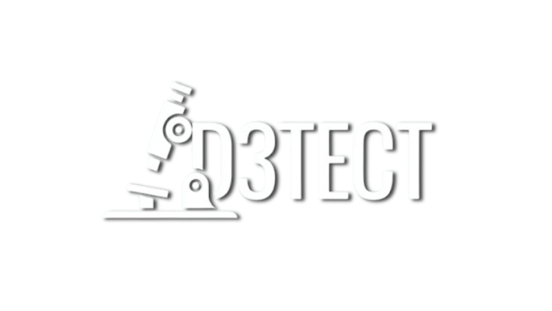

# Detect - La puissance de l’IA au service de vos organoïdes cérébraux

[](https://www.python.org/downloads/release/python-3712/)
[](https://streamlit.io/)

<p align="center">
  
</p>

---

## Notre solution

D3TECT est une application web intelligente conçue pour faciliter le suivi de la croissance des organoïdes cérébraux. Grâce à un détourage automatique fiable et rapide, elle permet d’analyser un grand nombre d’images tout en conservant une excellente précision. 

Notre solution simplifie l’analyse visuelle et quantitative au fil du temps, offrant une solution efficace, cohérente et reproductible pour accélérer la recherche et se concentrer sur l’innovation.

---

## Installation de D3TECT 

Suivez ces étapes pour faire fonctionner la webapp sur votre ordinateur :

## Étape 1 : Récupérer le projet
1. Cliquez sur le bouton vert "**Code**" en haut de cette page
2. Sélectionnez "**Download ZIP**"
3. Décompressez le dossier `.zip` à l'emplacement de votre choix

## Étape 2 : Installer Python (Version spécifique)
1. Ce projet nécessite "**Python 3.7.12**". Téléchargez-le ici : [Python 3.7.12](https://www.python.org/downloads/release/python-3712/)
2. Lancez l'installation
3. **Important :** Cochez la case **"Add Python 3.7 to PATH"** avant de cliquer sur "**Install Now**"
   
## Étape 3 : Préparer l'environnement
Ouvrez votre terminal (Invite de commandes sur Windows ou Terminal sur macOS/Linux) et déplacez-vous dans le dossier du projet :

1. Installation de Streamlit : 
```pip install streamlit ```


2. Installation des autres bibliothèques requises :
```pip install -r requirements.txt```

## Utilisation
Une fois l'installation terminée, vous pouvez lancer l'application avec la commande suivante tout en restant dans le dossier du projet :
```streamlit run app.py```

---

## Technologies utilisées

Le projet s'appuie sur un écosystème Python moderne pour garantir rapidité et interactivité :

* **Langage :** [Python 3.7.12](https://www.python.org/) 
* **Interface Web :** [Streamlit](https://streamlit.io/) (Framework pour applications Data)
* **Gestion des données :** Pandas & NumPy (Manipulation de tableaux et calculs)
* **Modèles & Détection :** Scikit-Learn / OpenCV (Analyse d'images ou modèles prédictifs)

---

## Structure du projet

L'organisation des fichiers permet une maintenance simplifiée :

```text
📂 Detect
├─ models                  # Contenant le model de segmentation
├─ images                  # Dossier avec les images du projet
├── app.py                 # Point d'entrée principal de l'application
├── requirements.txt       # Liste des dépendances à installer
└── README.md              # Documentation du projet
